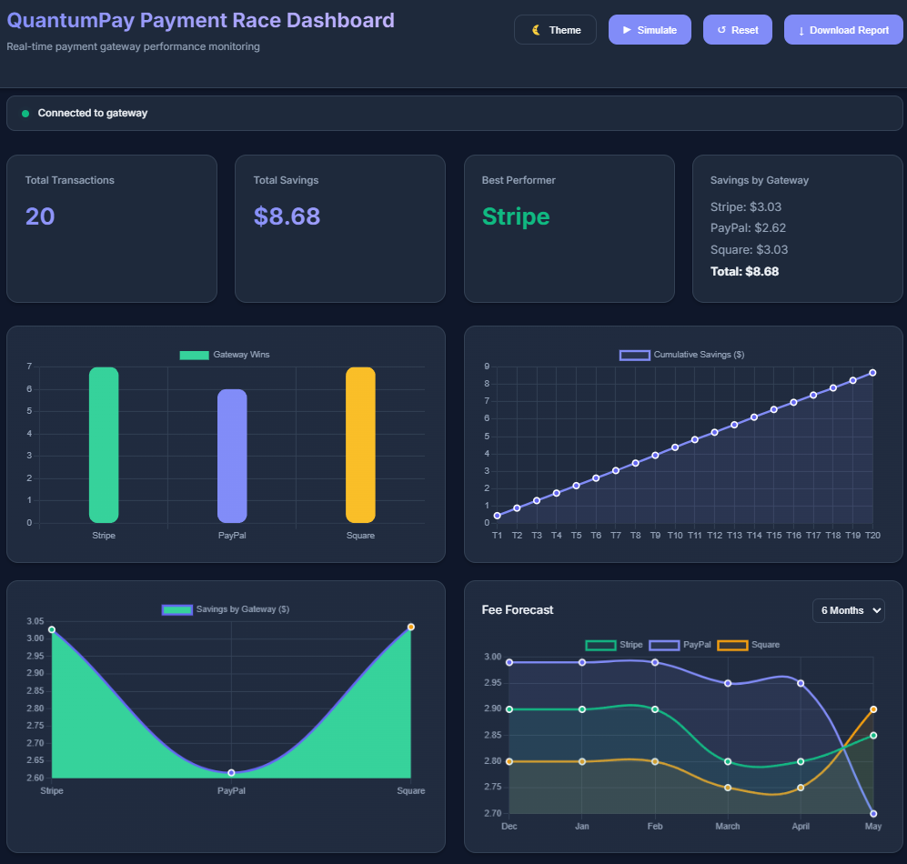
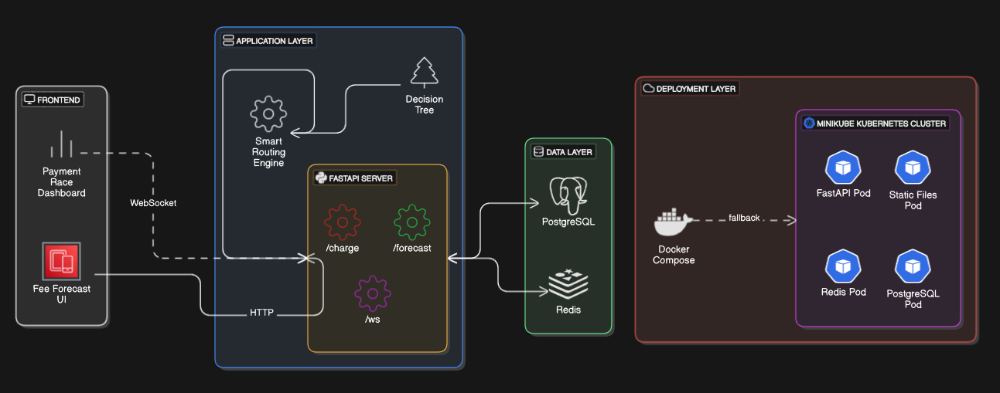

# QuantumPay

**Revolutionizing Payment Gateway Optimization with Quantum Computing**

[](https://www.python.org/)
[](https://fastapi.tiangolo.com/)
[](https://qiskit.org/)
[](https://minikube.sigs.k8s.io/)
[](https://www.docker.com/)
[](https://redis.io/)

---

## What is QuantumPay?

QuantumPay is a cutting-edge fintech solution that leverages quantum computing to optimize payment gateway selection. By utilizing quantum algorithms, the application identifies cost-effective and efficient payment gateways (e.g., Stripe, PayPal, Square) for every transaction.

It empowers businesses with real-time dashboards, providing insights into cost savings, transaction performance, and predictive fee analytics, while blending quantum and classical computing techniques to tackle complex payment routing problems.

---

## Problem This System Solves

Businesses face challenges such as high transaction fees, inconsistent gateway performance, and lack of optimization in payment routing. QuantumPay addresses these by:
- **Reducing Costs**: Dynamically choosing gateways with the lowest fees.
- **Improving Reliability**: Optimizing performance metrics like latency and uptime.
- **Scalability**: Adapting to varying gateway conditions through real-time data.

---

## Why Build QuantumPay?

Our mission is to bring quantum computing to fintech, solving optimization problems beyond the reach of traditional methods. QuantumPay was created to provide:
1. **Empowerment for SMEs**: Affordable tools to reduce operational costs.
2. **Innovation in Fintech**: A demonstration of real-world quantum computing applications.

---

## Key Features

- **Quantum Gateway Optimization**: Uses Qiskit for selecting the optimal payment gateway.
- **Real-Time Dashboard**: Tracks savings and transaction data with a responsive UI.
- **Fee Predictions**: Provides forecasting for financial planning.
- **Data Persistence**: Ensures secure and consistent data storage using PostgreSQL.
- **Scalable Architecture**: Deployed with Kubernetes for reliability.

---

## Using QuantumPay

### Simulate Transactions
- Click the "Simulate" button to run 20 transaction sets. QuantumPay uses Qiskit to optimize gateway selection, and the dashboard updates with results.

### Forecast Fees
- Select a period (3, 6, or 12 months) to view predicted fees for each gateway.

### Analyze Savings
- Monitor savings by gateway and identify the best performer. Download a report of transaction data for further analysis.

---

### System Frontend

Below is a screenshot of the QuantumPay dashboard:



---

## Architecture Overview



QuantumPay is designed using:
1. **Backend**: FastAPI to serve APIs and handle business logic.
2. **Frontend**: Web-based dashboard built with JavaScript, Chart.js, and CSS.
3. **Quantum Module**: Implements optimization algorithms using Qiskit.
4. **Database**: PostgreSQL for data storage and Redis for caching.
5. **Deployment**: Kubernetes (via Minikube) ensures scalability and streamlined operations.

---

## Getting Started

### Prerequisites
- **Python 3.12+**
- **Docker**
- **Minikube**

### Installation

Clone the repository:
```bash
mkdir project
https://github.com/bibash-dev/QuantumPay.git
cd quantum_pay
